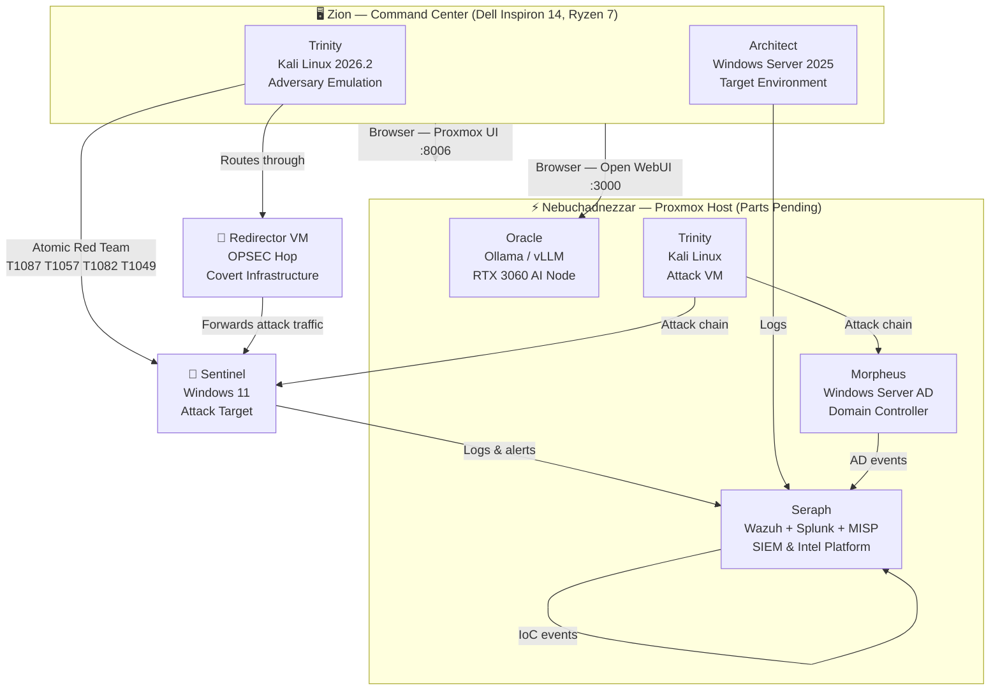

# Matrix Project: Threat-Informed Purple Team Homelab

Jarron Jackson | SPC Cybersecurity A.S. to B.A.S. | Purple Team Operator Track | Army Veteran

---


## Lab Architecture



## Operational Metrics

| Metric | Status |
|---|---|
| Degree Progress | A.S. 20% — B.A.S. Planned |
| ATT&CK Techniques Documented | 4 (T1087.001, T1057, T1082, T1049) |
| Portfolio Artifacts Pushed | 12 |
| Active Protective Baselines | 1/4 (Zion hardened) |
| Detection Rules in Production | 0 (Sigma drafts per technique — pending Seraph) |
| VECTR Threat Resilience Score | 0.00% (Phase 1 baseline) |
| Intelligence Artifacts | Diamond Model x4, YARA Rules x6, JA4 Guide, MISP Setup |
| Black Hat USA 2026 | Scholarship recipient — Aug 3-7, Planet Hollywood |

---

## Infrastructure

| Node | Role | OS | Status |
|---|---|---|---|
| **Zion** | Hardened Operator Workstation | Windows 11 Home | Production |
| **Trinity** | Adversary Emulation Platform | Kali Linux 2026.2 | Active |
| **Sentinel** | Attack Target | Windows 11 | Hardening Pending |
| **Nebuchadnezzar** | Proxmox Hypervisor | Proxmox VE | Parts Pending |
| **Seraph** | SIEM / Log Engine + MISP | Wazuh + Elastic + MISP | Post-Neb |
| **Morpheus** | Domain Controller | Windows Server + AD | Post-Neb |
| **Oracle** | AI Inference Node | Ollama / vLLM + RTX 3060 | Post-Neb |

Full Neb build spec: [NEB_BUILD.md](NEB_BUILD.md)

---

## Phase 1 — Baseline and Recon ✅ COMPLETE

- [x] Zion OS hardening (VeraCrypt, firewall, UAC, audit logging)
- [x] PCAP baseline analysis — 50k packets, Wireshark/Scapy
- [x] T1087.001 — Local Account Discovery
- [x] T1057 — Process Discovery
- [x] T1082 — System Information Discovery
- [x] T1049 — Network Connection Discovery
- [ ] Sentinel Windows hardening
- [ ] OpenVAS vulnerability scan — Trinity to Sentinel
- [ ] DVWA web app lab (SQLi, XSS, CSRF)
- [ ] iptables hardening — Trinity
- [ ] Password attack labs (John the Ripper, rainbow tables)
- [ ] Network attack labs (ARP poisoning, SYN flood)
- [ ] Rules of Engagement document

Purple team writeups: [/purple-team/](purple-team/) | Lab guides: [/docs/](docs/)

---

## Phase 2 — Exploitation 🔲 NEXT

- [ ] T1003 — Credential Dumping (Sentinel)
- [ ] T1053.005 — Scheduled Task Persistence (Sentinel)
- [ ] T1562.001 — Disable Security Tools (Sentinel)
- [ ] Full engagement documented in VECTR
- [ ] Forensic artifact capture during attack chain

---

## Intelligence Layer 🔲 IN PROGRESS

Every attack simulation produces four intelligence artifacts modeled after FBI Cyber Division and CIA CTI analyst workflows:

| Artifact | Tool | File |
|---|---|---|
| Attribution writeup | Diamond Model | [/purple-team/](purple-team/) |
| Detection signature | YARA rule | [YARA_RULES.md](intelligence/YARA_RULES.md) |
| TLS fingerprint | JA4/JA3 via Zeek | [JA4_FINGERPRINTING.md](intelligence/JA4_FINGERPRINTING.md) |
| IoC event | MISP | [MISP_SETUP.md](intelligence/MISP_SETUP.md) |

- [x] Diamond Model template created
- [x] Phase 1 Diamond writeups complete (4 techniques)
- [x] Phase 2 Diamond templates ready
- [x] YARA rules written (6 rules — Phase 2-4)
- [x] JA4/JA3 fingerprinting guide created
- [x] MISP setup and IoC tracking guide created
- [x] OPSEC infrastructure / redirector simulation guide created
- [x] ATT&CK Navigator heatmap guide created
- [ ] MISP deployed on Seraph (pending Neb build)
- [ ] ATT&CK Navigator layer exported and embedded

---

## Phase 3 — Detection Engineering 🔲 PLANNED

- [ ] Seraph deployed on Neb (Wazuh)
- [ ] CALDERA automated attack chains
- [ ] Retest full Phase 1 and 2 chain with detection active
- [ ] Custom Wazuh/Sigma rules per technique
- [ ] VECTR before/after heatmap
- [ ] JA4/JA3 TLS fingerprinting of C2 traffic

---

## Phase 4 — Enterprise Simulation 🔲 PLANNED

- [ ] Morpheus domain controller deployed
- [ ] GOAD (Game of Active Directory) attack scenarios
- [ ] Kerberoasting, pass-the-hash, lateral movement
- [ ] IR playbook built from engagement findings
- [ ] SigmaHQ contribution (capstone)
- [ ] ATT&CK Navigator heatmap exported and committed

---

## Phase 5 — Infrastructure Hardening 🔲 PLANNED

- [ ] OPNsense VM on Neb
- [ ] VLAN segmentation — isolate lab from home network
- [ ] Suricata IDS inside OPNsense
- [ ] Honeypot deployment behind UTM
- [ ] Zeek network monitoring
- [ ] Feed all logs into Seraph

---

## AI Integration

- **Oracle** — Local LLM inference node (Ollama/vLLM + RTX 3060 GPU passthrough on Neb)
- **skill_query.py** — Python RAG script querying 754 cybersecurity skills via local Ollama API
- **754 skills** — Mapped to MITRE ATT&CK, NIST CSF, D3FEND, MITRE ATLAS, NIST AI RMF
- **Anthropic-Cybersecurity-Skills** — Installed at `C:\Users\Jarron\.claude\skills\cybersecurity`

---

## Repository Structure

```
homelab/
├── purple-team/          ATT&CK technique writeups & Diamond Model attribution reports
│   ├── PHASE1_DIAMOND.md
│   ├── PHASE2_DIAMOND.md
│   ├── OPSEC_INFRASTRUCTURE.md
│   └── ATTACK_NAVIGATOR_GUIDE.md
├── intelligence/         MISP configs, YARA rules, JA4 fingerprints, CTI workflows
│   ├── DIAMOND_MODEL_TEMPLATE.md
│   ├── YARA_RULES.md
│   ├── JA4_FINGERPRINTING.md
│   └── MISP_SETUP.md
├── docs/                 Lab guides, architecture docs, Black Hat prep
│   └── BLACK_HAT_PREP.md
├── scripts/              Automation and query tools
│   └── skill_query.py
├── flowsint/             OSINT graph exploration tool
├── NEB_BUILD.md          Nebuchadnezzar hardware spec (~$1,927)
├── SKILLS_ROADMAP.md     754 skills across 4 learning tracks
└── README.md             This file
```

---

## Definition of Done

```
[1] Execute    - Run the attack or deploy the control
[2] Validate   - Confirm in logs, SIEM, or manual observation
[3] Document   - Diamond Model writeup + YARA rule + JA4 fingerprint + MISP IoC
[4] Commit     - git add / commit / push to master
```

---

## GitHub
https://github.com/jjackson0724/homelab